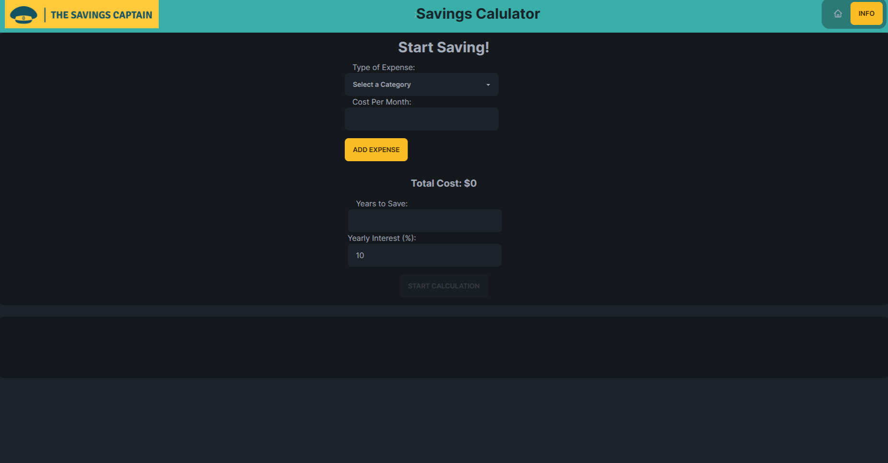

# Savings Calculator

The Savings Calculator is a web application that allows users to estimate their potential savings over time based on their monthly contributions and the desired number of years. The calculator takes into account the compounded interest to provide an accurate estimate of the final amount.

## Features

- Input fields for monthly savings, number of years, and yearly interest rate.
- Calculation of the total accumulated savings based on the provided inputs.
- Clear functionality to reset the calculator and start a new calculation.

## Technologies Used

- HTML
- CSS
- JavaScript
- React
- Next.js
- TailwindCSS
- Daisyui

## Usage

1. Enter the monthly savings amount in the designated input field.
2. Input the desired number of years for saving.
3. Specify the yearly interest rate for the investment.
4. Click the "Calculate" button to calculate the estimated total savings.
5. To reset the calculator, click the "Reset" button.

## Getting Started

To get a copy of the project up and running on your local machine, follow these steps:

1. Clone the repository: `git clone https://github.com/your-username/savings-calculator.git`
2. Navigate to the project directory: `cd savings-calculator`
3. Open the `index.html` file in your web browser.

## Contributing

Contributions are welcome! If you would like to contribute to this project, please follow these steps:

1. Fork the repository.
2. Create a new branch: `git checkout -b feature/my-new-feature`
3. Make your changes and commit them: `git commit -m 'Add some feature'`
4. Push to the branch: `git push origin feature/my-new-feature`
5. Submit a pull request.

## License

This project is licensed under the [MIT License](https://opensource.org/licenses/MIT).

## Why I made this project

This was a request from The Savings Captain. Check out the full site this is attached to from the home button on the live page
or use this link: <https://thesavingscaptain.com/>
